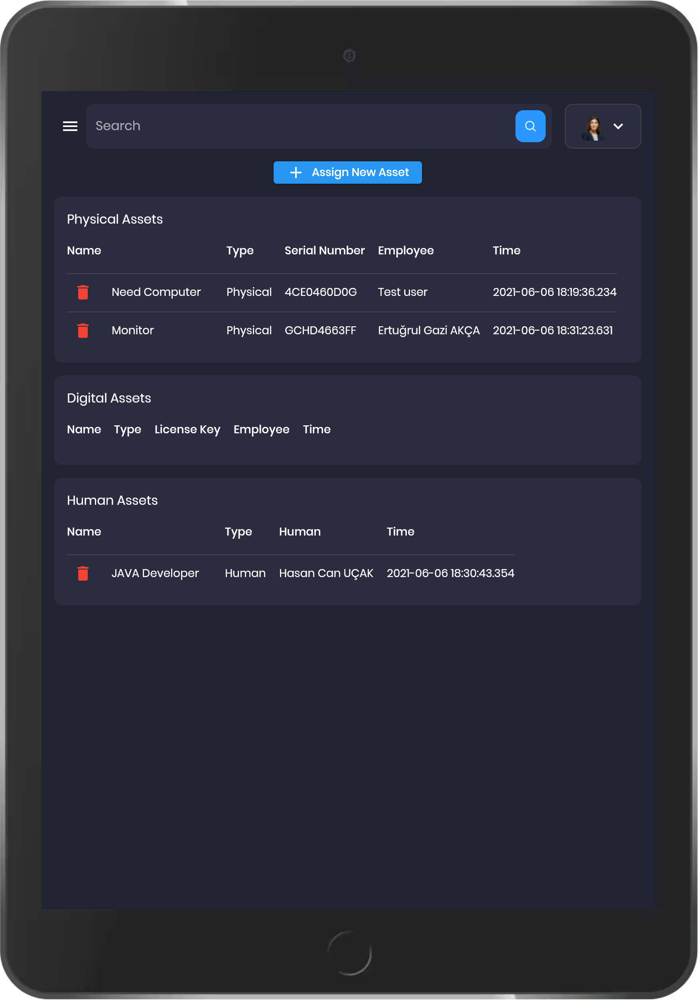
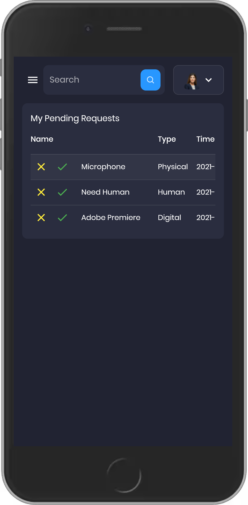
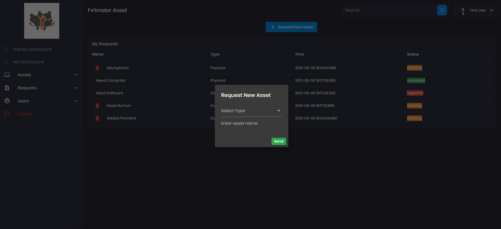
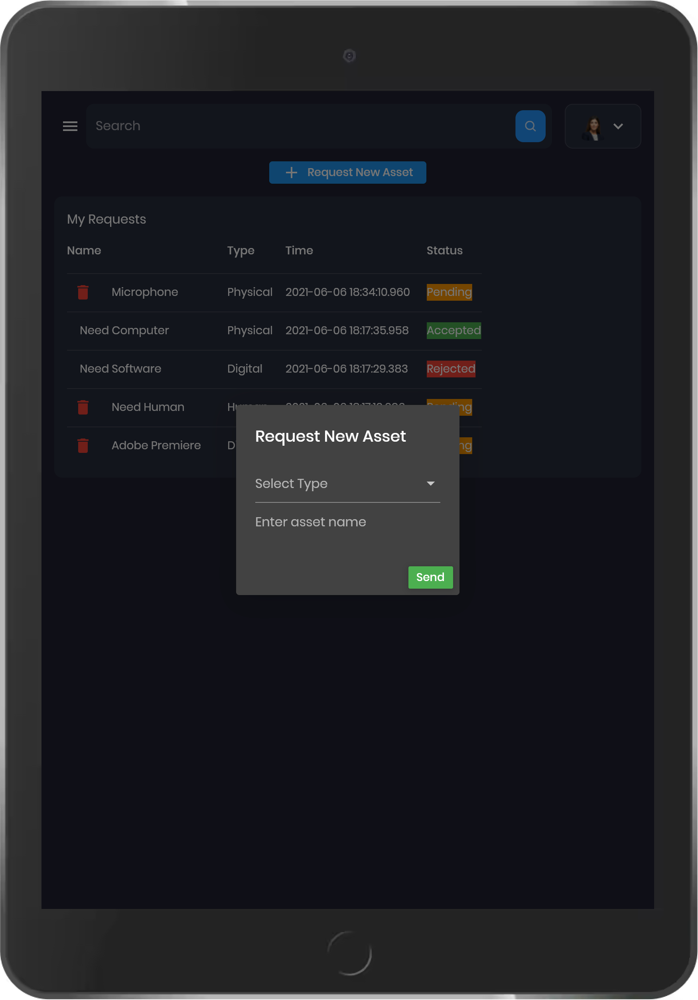

# Fırtınalar Asset Management Tool 
* Admin Dashboard

* Add new user

* Assign Asset

* Assign Asset From Request

* Assigned Assets

* Login

* My Assets

* My Dashboard

* My Requests

* Request List

* Request New Asset From Admin

* User List

## Firebase

# Git Using Guide

- git pull
- git checkout -b branch-name (branch name can be call feature name)
- git push -u origin branch-name
- git status
- git add .
- git commit -m "commit message"
- git push
- git checkout main 
- git pull 
- git checkout branch-name
- git merge main 
- git push 
- git checkout main
- git merge branch-name

- git diff (You can see all changes that not staged)

- pull request example